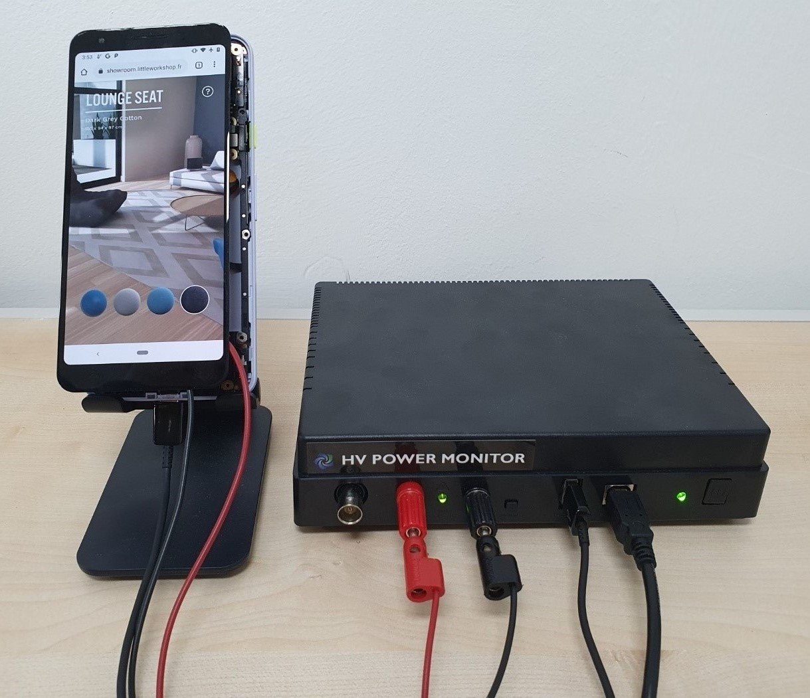

# zTT for Pixel 3a

For running zTT on Pixel 3a, you need *a client device* (e.g., labtop or desktop) which is connected to Monsoon power monitor for measuring power consumption of Pixel 3a and also you need *a device for zTT agent server*.

To connect monsoon power monitor and your Pixel 3a device, you need to disassemble Pixel 3a at first.
Then, remove the battery and re-connect the battery logic board.
After that, connect monsoon power monitor and Pixel 3a with battery connection cables as shown in below picture.

During running zTT, the client device and Pixel 3a communiate each other via adb through WiFi connection.

**Note that, the client device, the agent server device and Pixel 3a should connected to _same WiFi AP_.**



## Install dependencies

#### 1. Pixel 3a
Install WiFi-adb application from below link. <br>
https://play.google.com/store/apps/details?id=com.ttxapps.wifiadb&hl=ko&gl=US

#### 2. Client & Agent server device

Install python dependencies on a client device.

```bash
$ cd zTT/Pixel_3a
$ pip install -r requirements.txt
```

## Instruction

Please turn on Monsoon power monitor first.

Then, run *power_on.py* to turn on Pixel 3a.

```bash
$ python power_on.py
```

### 1. Pixel 3a
 1. Start WiFi-adb and **check your IP address**.
    Note that, you need the IP address for connecting Pixel 3a to the client device.
 2. Start an application on Pixel 3a.

### 2. Agent server device
Run *agent.py.*

```bash
$ python agent.py
```
Okay, now agent server is waiting for client!

### 3. Client device
Run *client.py.*

#### Usage of client.py

```
usage: client.py [-h] --app {showroom,skype,call} [--exp_time EXP_TIME]
                      --server_ip SERVER_IP [--server_port SERVER_PORT]
                      --target_fps TARGET_FPS --pixel_ip PIXEL_IP

optional arguments:
  -h, --help            show this help message and exit
  --app {showroom,skype,call}   Application name for learning
  --exp_time EXP_TIME           Time steps for learning
  --server_ip SERVER_IP         Agent server IP
  --server_port SERVER_PORT     Agent server port number
  --target_fps TARGET_FPS       Target FPS
  --pixel_ip PIXEL_IP           Pixel device IP for connecting device via adb
```

#### Available applications

* Showroom VR \[1\]
##### Example
```bash
$ python client.py --app showroom --exp_time 500 --server_ip 192.168.1.24 --target_fps 60 --pixel_ip 192.168.1.35
```

* Skype \[2\]
##### Example
```bash
$ python client.py --app skype --exp_time 500 --server_ip 192.168.1.24 --target_fps 60 --pixel_ip 192.168.1.35
```

* Call of duty 4 \[3\]
##### Example
```bash
$ python client.py --app call --exp_time 500 --server_ip 192.168.1.24 --target_fps 60 --pixel_ip 192.168.1.35
```

## References

\[1\] Little Workshop. WebVR Showroom. https://showroom.littleworkshop.fr/, 2017.

\[2\] Skype Inc. Skype. https://skype.com/, 2003.

\[3\] Activision Publishing, Inc., Tencent Games Co., Ltd. Call of duty: Mobile. https://www.callofduty.com/mobile, 2019.

