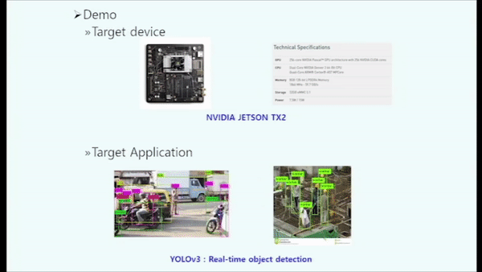

# zTT: Learning-based DVFS with Zero Thermal Throttling for Mobile Devices \[*MobiSys'21*\] - Artifact Evaluation

This repository contains all the artifacts necessary to run zTT on NVIDIA Jetson TX2 & Pixel 3a.

Each subdirectory contains the corresponding source codes and instructions to repeat the results of the paper.

Please follow the detailed instructions in each subdirectory.

## Demo Video

## Paper Abstract
DVFS (dynamic voltage and frequency scaling) is a systemlevel technique that adjusts voltage and frequency levels of CPU/GPU at runtime to balance energy efficiency and high performance. DVFS has been studied for many years, but it is considered still challenging to realize a DVFS that performs ideally for mobile devices for two main reasons: i) an optimal power budget distribution between CPU and GPU in a power-constrained platform can only be defined by the application performance, but conventional DVFS implementations are mostly application-agnostic; ii) mobile platforms experience dynamic thermal environments for many reasons
such as mobility and holding methods, but conventional implementations are not adaptive enough to such environmental changes. In this work, we propose a deep reinforcement learning-based frequency scaling technique, zTT. zTT learns thermal environmental characteristics and jointly scales CPU and GPU frequencies to maximize the application performance in an energy-efficient manner while achieving zero thermal throttling. Our evaluations for zTT implemented on Google Pixel 3a and NVIDIA JETSON TX2 platform with various applications show that zTT can adapt quickly to changing thermal environments, consistently resulting in high application performance with energy efficiency. In a high-temperature environment where a rendering application with the default mobile DVFS fails to keep producing more than a target frame rate, zTT successfully manages to do so even with 23.9% less average power consumption.

  

## Requirements

### Jetson TX 2 
* Jetpack 3.3
* CUDA 9.0
* cuDNN 7.1.5
* OpenCV 3.4.2

### Pixel 3a
* Android 9 (Kernel version 4.9)

### Client & Agent server
* Ubuntu 18.04

## Contents

### Jetson TX2
* client.py   -   Client code
* agent.py    -   Agent server code
### Pixel 3a
* client.py  -  Client code
* agent.py  -  Agent server code
* power_on.py - Script to turn on Pixel 3a through Monsoon power monitor (Run on client)
* power_off.py - Script to turn off Pixel 3a through Monsoon power monitor (Run on client)

